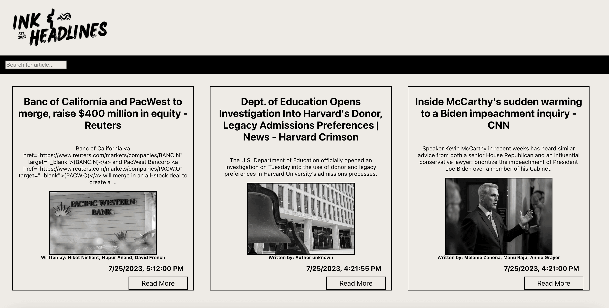
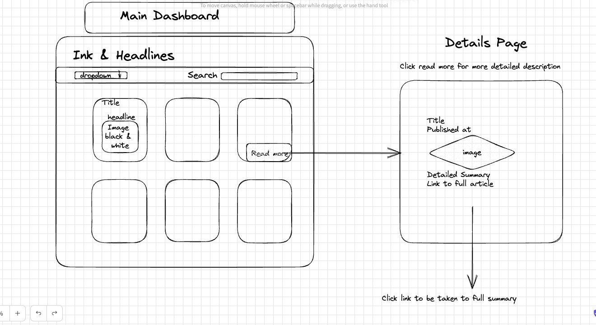

# Newsreader App Take Home Challenge
- [Project Spec](https://mod4.turing.edu/projects/take_home/take_home_fe)
- [News API](https://newsapi.org/)

# Summary

 I created this application with simplicity in mind, incorporating a vintage-inspired newspaper design to evoke elegance and charm. Users can easily browse and search articles, clicking through for previews and accessing full details by selecting specific articles. The convenience of the search function allows users to effortlessly find articles of interest by entering keywords or topics. I aimed to deliver a sophisticated and user-friendly platform that caters to various news reading preferences. Whether you're a casual reader or a news enthusiast, I hope you thoroughly enjoy your journey through the world of news with this application.

Technologies Used:
- Javascript
- HTML & CSS
- React & React Router

# Wireframe

# Wins & Challenges

Challenges:  Create a fully functioning, intuitive UI, and MVP in 8 hours.
- rendering details page with individual ids
- functionality for displaying searched articles from a different end point. 

Win:  Successfully produce a well-thought out React application within the time limit!

# Contributors

Samantha McElhinney - [GitHub](https://github.com/SamanthaMcElhinney) - [LinkedIn](https://www.linkedin.com/in/samantha-mcelhinney/)

# Future Iterations

- Pagination - fetching all pages of data from the API.
- Drop down option with categories for searching articles.
- More thorough error handling.